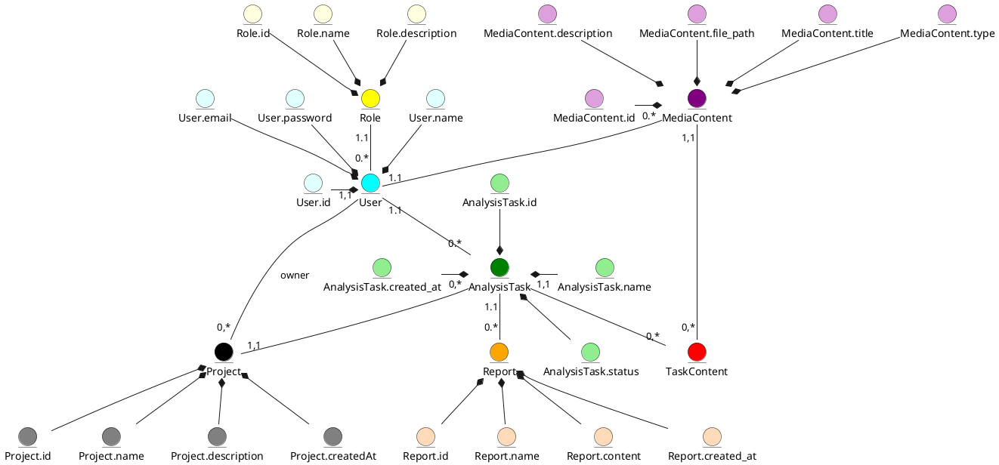
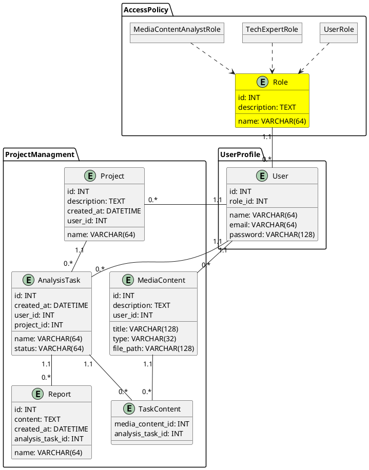

# Проєктування бази даних

## Модель бізнес-об'єктів

```plantuml
@startuml

entity User #cyan
entity User.id #lightCyan
entity User.name #lightCyan
entity User.email #lightCyan
entity User.password #lightCyan

User.id -r-* User
User.name --* User
User.email --* User
User.password --* User

entity Role #yellow
entity Role.name #lightYellow
entity Role.description #lightYellow
entity Role.id #lightYellow

Role.name --* Role
Role.description --* Role
Role.id --* Role

entity MediaContent #purple
entity MediaContent.id #plum
entity MediaContent.title #plum
entity MediaContent.type #plum
entity MediaContent.description #plum
entity MediaContent.file_path #plum

MediaContent.id -r-* MediaContent
MediaContent.title --* MediaContent
MediaContent.type --* MediaContent
MediaContent.description --* MediaContent
MediaContent.file_path --* MediaContent

entity AnalysisTask #green
entity AnalysisTask.id #lightGreen
entity AnalysisTask.name #lightGreen
entity AnalysisTask.status #lightGreen
entity AnalysisTask.created_at #lightGreen

AnalysisTask.id --* AnalysisTask
AnalysisTask.name -l-* AnalysisTask
AnalysisTask.status -u-* AnalysisTask
AnalysisTask.created_at -r-* AnalysisTask

entity Report #orange
entity Report.id #peachPuff
entity Report.name #peachPuff
entity Report.content #peachPuff
entity Report.created_at #peachPuff

Report.id -u-* Report
Report.name -u-* Report
Report.content -u-* Report
Report.created_at -u-* Report

User "0.*" -u- "1.1" Role
User "1.1" -- "0.*" AnalysisTask
MediaContent "0.*" -- "1.1" User
AnalysisTask "1.1" -- "0.*" Report

entity Project #black
entity Project.id #gray
entity Project.name #gray
entity Project.description #gray
entity Project.createdAt #gray

Project.id -u-* Project
Project.name -u-* Project
Project.description -u-* Project
Project.createdAt -u-* Project

entity TaskContent #red
User "1,1" -- "0,*" Project : owner
MediaContent "1,1" -- "0,*" TaskContent
AnalysisTask "1,1" -- "0,*" TaskContent

AnalysisTask "0,*" -- "1,1" Project

@enduml
```

## ER-модель

```plantuml
@startuml
package ProjectManagment {
    entity Project {
        id: INT
        name: VARCHAR(64)
        description: TEXT
        created_at: DATETIME
        user_id: INT
    }

    entity AnalysisTask {
        id: INT
        name: VARCHAR(64)
        status: VARCHAR(64)
        created_at: DATETIME
        user_id: INT
        project_id: INT
    }

    entity TaskContent {
        media_content_id: INT
        analysis_task_id: INT
    }

    entity MediaContent {
        id: INT
        title: VARCHAR(128)
        type: VARCHAR(32)
        description: TEXT
        file_path: VARCHAR(128)
        user_id: INT
    }

    entity Report {
        id: INT
        name: VARCHAR(64)
        content: TEXT
        created_at: DATETIME
        analysis_task_id: INT
    }
}

package AccessPolicy {
    entity Role #ffff00 {
        id: INT
        name: VARCHAR(64)
        description: TEXT
    }

    object UserRole
    object TechExpertRole
    object MediaContentAnalystRole
}

package UserProfile {
    entity User {
        id: INT
        role_id: INT
        name: VARCHAR(64)
        email: VARCHAR(64)
        password: VARCHAR(128)
    }
}

ProjectManagment.MediaContent "0.*" -- "1.1" UserProfile.User
ProjectManagment.MediaContent "1.1" -- "0.*" ProjectManagment.TaskContent
AccessPolicy.Role "1.1" -- "0.*" UserProfile.User
UserProfile.User "1.1" -- "0.*" ProjectManagment.AnalysisTask
UserProfile.User "1.1" -- "0.*" ProjectManagment.Project
ProjectManagment.Project "1.1" -- "0.*" ProjectManagment.AnalysisTask
ProjectManagment.AnalysisTask "1.1" -- "0.*" ProjectManagment.Report
ProjectManagment.AnalysisTask "1.1" -- "0.*" ProjectManagment.TaskContent

AccessPolicy.UserRole .d.> AccessPolicy.Role
AccessPolicy.TechExpertRole .d.> AccessPolicy.Role
AccessPolicy.MediaContentAnalystRole .d.> AccessPolicy.Role


@enduml
```

## Реляційна схема

  

