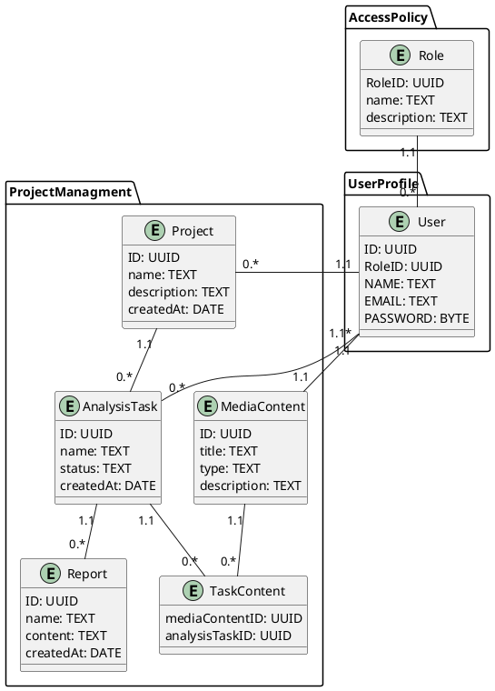

# Проєктування бази даних

## Модель бізнес-об'єктів 
//task1

## ER-модель

```plantuml
@startuml
package ProjectManagment {
    entity Project {
        ID: UUID
        name: TEXT
        description: TEXT
        createdAt: DATE
    }

    entity AnalysisTask {
        ID: UUID
        name: TEXT
        status: TEXT
        createdAt: DATE
    }

    entity TaskContent {
        mediaContentID: UUID
        analysisTaskID: UUID
    }

    entity MediaContent {
        ID: UUID
        title: TEXT
        type: TEXT
        description: TEXT
    }

    entity Report {
        ID: UUID
        name: TEXT
        content: TEXT
        createdAt: DATE
    }
}

package AccessPolicy {
    entity Role {
        RoleID: UUID
        name: TEXT
        description: TEXT
    }
}

package UserProfile {
    entity User {
        ID: UUID
        RoleID: UUID
        NAME: TEXT
        EMAIL: TEXT
        PASSWORD: BYTE
    }
}

ProjectManagment.MediaContent "1.1" -- "1.1*" UserProfile.User
ProjectManagment.MediaContent "1.1" -- "0.*" ProjectManagment.TaskContent
AccessPolicy.Role "1.1" -- "0.*" UserProfile.User
UserProfile.User "1.1" -- "0.*" ProjectManagment.AnalysisTask
UserProfile.User "1.1" -- "0.*" ProjectManagment.Project
ProjectManagment.Project "1.1" -- "0.*" ProjectManagment.AnalysisTask
ProjectManagment.AnalysisTask "1.1" -- "0.*" ProjectManagment.Report
ProjectManagment.AnalysisTask "1.1" -- "0.*" ProjectManagment.TaskContent


@enduml
```

## Реляційна схема
//task3
