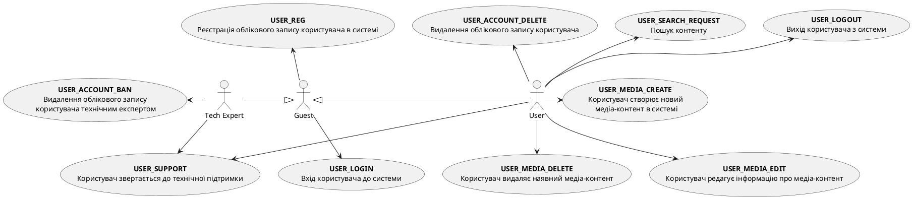
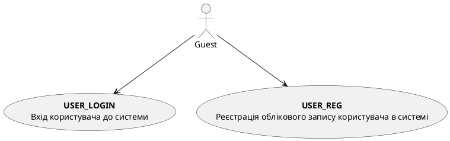
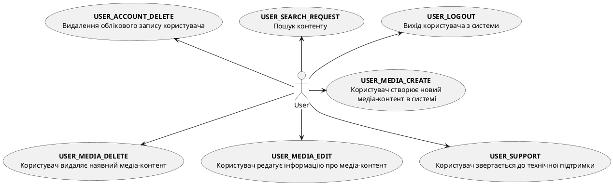
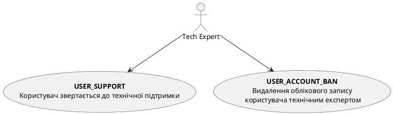
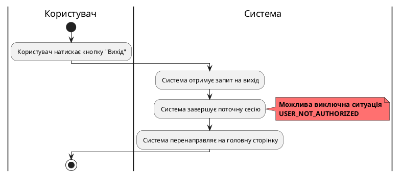
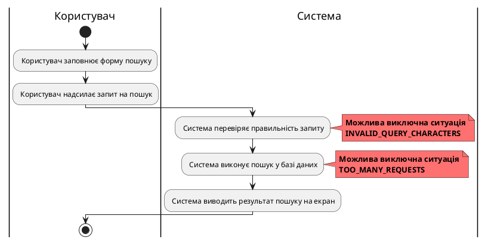

# Розроблення функціональних вимог до системи

## Модель прецедентів

### 1. Загальна схема

Рис. 1 Діаграма прецедентів

### 2. Схема використання для гостя

Рис. 2 Схема можливостей гостя

### 3. Схема використання для користувача

Рис. 3 Схема можливостей користувача

### 4. Схема використання для технічного експерта

Рис. 4 Схема можливостей технічного експерта

### 5. Сценарії використання для незареєстрованого користувача (гостя)
### Реєстрація
**ID**: UserReg

**НАЗВА**: Реєстрація облікового запису

**УЧАСНИКИ**: Користувач, Система

**ПЕРЕДУМОВИ**: Користувач відсутній в системі

**РЕЗУЛЬТАТ**: Створений обліковий запис

**ВИНЯТКОВІ СИТУАЦІЇ**: 
1. Користувач існує в системі - AlreadyRegisteredException
2. Користувач реєструється без введеня даних потрібних для реєстрації - DataMissingException
3. Ведденя некореткних даних користувачем - InvalidDataException

**СЦЕНАРІЙ** :
1. Користувач запускає сторінку реєстрації 
2. Користувач вводить особисті дані. Наприклад: електронну почту, ім'я, прізвище і т.д.
3. Система перевіряє наявність користувача з такими ж даними, що існуть в системі
4. Система створює обліковий запис 
5. Система вказує користувачу, що обліковий запис було створено

@startuml

|Гість|
start
: Користувач натискає кнопку "Реєстрація";
: Користувач передає реєстраційні дані;

note left #red
<b>Можлива виключна ситуація</b>
<b>"InvalidDataException"</b>
end note

: Користувач натискає кнопку "Підтвердити реєстрацію";

|Система|
: Система отримує запит на реєстрацію;
: Перевірка реєстраційних данних;
note right #ff0000
<b>Можлива виключна ситуація</b>
<b>"DataMissingException"</b>
end note
: Система перевіряє наявність облікового запису;
note right #ff0000
<b>Можлива виключна ситуація</b>
<b>"AlreadyRegisteredException"</b>
end note
: Система створює обліковий запис;
: Система вказує на створення облікового запису;

|Гість|
stop

@enduml

**Рис. 5.1** Сценарій реєстрації користувача

### Вхід

**ID**: UserLog

**НАЗВА**: Вхід до облікового запису

**УЧАСНИКИ**: Користувач, Система

**ПЕРЕДУМОВИ**: Користувач наявний в системі

**РЕЗУЛЬТАТ**: Вхід до облікового запису

**ВИНЯТКОВІ СИТУАЦІЇ**:
1. Введеня некоректних даних - DataNotFoundException
2. Користувача немає в системі - NotRegisteredException
3. Користувач виконав забагато спроб входу до облкіового запису з помиклою в результаті - TooManyActionsException

**СЦЕНАРІЙ** :
1. Користувач відкриває сторінку входу
2. Користувач вводить дані для входу
3. Перевірка на наявність обліково запису
4. Перевірка на правильність
5. Виконання входу в облікову систему

@startuml

|Гість|
start
: Користувач натискає кнопку "Вхід";
: Користувач вводить авторизаційні дані;

note left #red
<b>Можлива виключна ситуація</b>
<b>"TooManyActionsException"</b>
end note

: Користувач натискає кнопку "Увійти";

|Система|
: Система отримує запит на вхід у обліковий запис;
: Система перевіряє отримані дані;
note right #ff0000
<b>Можлива виключна ситуація</b>
<b>"DataNotFoundException"</b>
end note
: Перевірка на наявність облікового запису;
note right #ff0000
<b>Можлива виключна ситуація</b>
<b>"NotRegisteredException"</b>
end note
: Система надає доступ до сторінки кабінету;
: Система повідомляє про успішний вхід в особистий кабінет;

|Гість|
stop

@enduml

**Рис. 5.2** Сценарій авторизації користувача

### 6. Сценарії використання для користувача

| **ID:**                   | USER_LOGOUT |
|---------------------------|----------------|
| **НАЗВА:**                | Вихід користувача з системи |
| **УЧАСНИКИ:**             | Користувач, Система |
| **ПЕРЕДУМОВИ:**           | Користувач авторизований у системі |
| **РЕЗУЛЬТАТ:**            | Вихід з системи |
| **ВИКЛЮЧНІ СИТУАЦІЇ:**    | Користувач не авторизований у системі (USER_NOT_AUTHORIZED) |
| **ОСНОВНИЙ СЦЕНАРІЙ:**    | Користувач натискає кнопку виходу (Logout) із системи |
|                           | Система завершує поточну сесію з користувачем |
|                           | Система перенаправляє користувача на головну сторінку додатку |

Рис. 7 Сценарій USER_LOGOUT

   
 

| **ID:**                   | USER_SEARCH_REQUEST |
|---------------------------|------------------------------------|
| **НАЗВА:**                | Пошук контенту            |
| **УЧАСНИКИ:**             | Користувач, Система                                |
| **ПЕРЕДУМОВИ:**           | Користувач має бути авторизований у системі        |
| **РЕЗУЛЬТАТ:**            | Знайдені дані відображаються на екрані             |
| **ВИКЛЮЧНІ СИТУАЦІЇ:**    | У запиті містяться недопустимі символи (INVALID_QUERY_CHARACTERS) |
|                           | Забагато запитів за короткий період (TOO_MANY_REQUESTS) |
| **ОСНОВНИЙ СЦЕНАРІЙ:**    | Користувач заповнює форму пошуку              |
|                           | Користувач надсилає запит на пошук |
|                           | Система виконує пошук у базі даних              |
|                           | Система виводить результат пошуку на екран       |

Рис. 8 Сценарій USER_SEARCH_REQUEST

  

// (USER_ACCOUNT_DELETE, USER_MEDIA_CREATE, USER_MEDIA_DELETE, USER_MEDIA_EDIT, USER_SUPPORT)
### 7. Сценарії використання для технічного експерта
// (USER_ACCOUNT_BAN)
