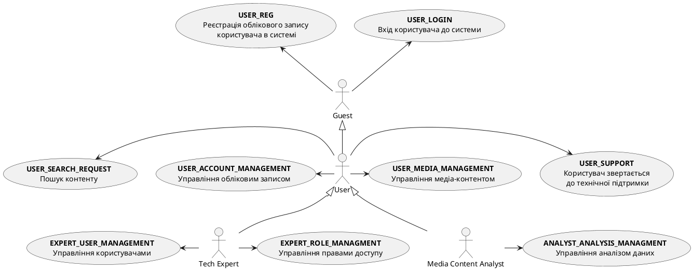
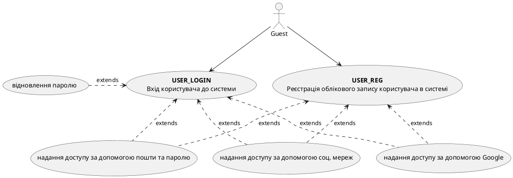
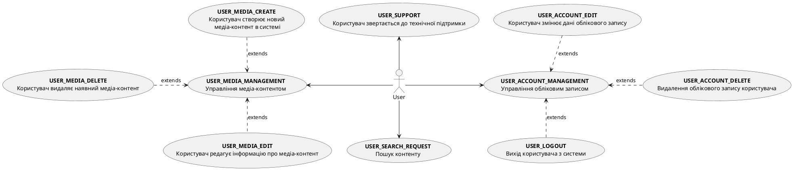
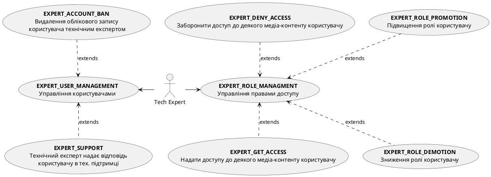
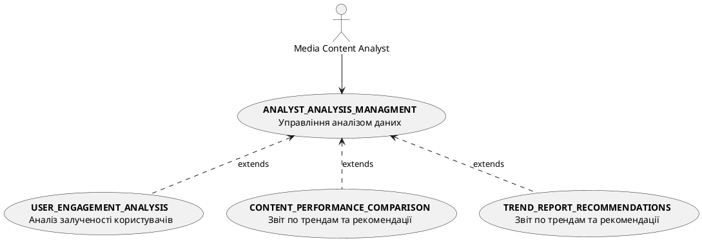
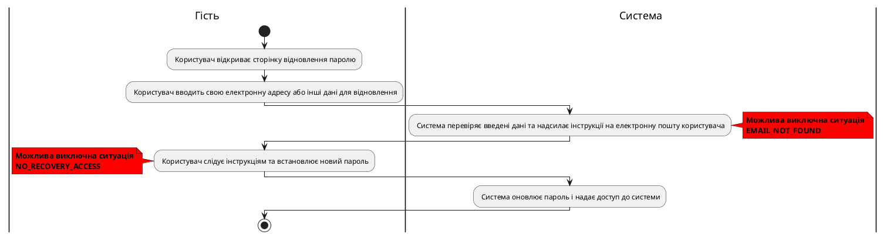
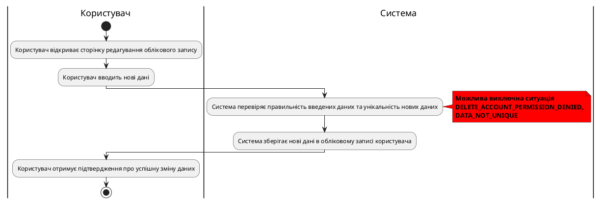

# Розроблення функціональних вимог до системи

## Модель прецедентів

### 1. Загальна схема

Рис. 1 Діаграма прецедентів

### 2. Схема використання для гостя

Рис. 2 Схема можливостей гостя

### 3. Схема використання для користувача

Рис. 3 Схема можливостей користувача

### 4. Схема використання для технічного експерта

Рис. 4 Схема можливостей технічного експерта

### 5. Схема використання для аналітика медіа-контенту

Рис. 5 Схема можливостей аналітика медіа-контенту

### 6. Сценарії використання для незареєстрованого користувача (гостя)

| **ID:**                   | USER_REG |
|---------------------------|----------------|
| **НАЗВА:**                | Реєстрація облікового запису користувача в системі |
| **УЧАСНИКИ:**             | Користувач, Система |
| **ПЕРЕДУМОВИ:**           | Користувач не має облікового запису в системі |
| **РЕЗУЛЬТАТ:**            | Створення нового облікового запису користувача |
| **ВИКЛЮЧНІ СИТУАЦІЇ:**    | Обліковий запис з введеними даними вже існує (ACCOUNT_ALREADY_EXISTS) |
|                           | Під час реєстрації введені некоректні дані (INVALID_REGISTRATION_DATA) |
| **ОСНОВНИЙ СЦЕНАРІЙ:**    | Користувач відкриває сторінку реєстрації |
|                           | Користувач вводить реєстраційні дані |
|                           | Система перевіряє наявність користувача з наданими даними |
|                           | Система створює обліковий запис з даними користувача |
|                           | Система повідомляє користувача про успішне створення його нового облікового запису |

**Рис. 6.1** Сценарій USER_REG

| **ID:**                   | USER_LOGIN |
|---------------------------|----------------|
| **НАЗВА:**                | Вхід користувача до системи |
| **УЧАСНИКИ:**             | Користувач, Система |
| **ПЕРЕДУМОВИ:**           | Користувач зареєстрований у системі |
| **РЕЗУЛЬТАТ:**            | Вхід користувача до системи |
| **ВИКЛЮЧНІ СИТУАЦІЇ:**    | Обліковий запис з введеними даними не існує (ACCOUNT_NOT_FOUND) |
|                           | Введений неправильний пароль (WRONG_PASSWORD) |
| **ОСНОВНИЙ СЦЕНАРІЙ:**    | Користувач відкриває сторінку авторизації |
|                           | Користувач вводить дані для авторизації |
|                           | Система перевіряє наявність користувача та правильність наданих даних |
|                           | Система авторизує користувача |

**Рис. 6.2** Сценарій USER_LOGIN

| **ID:**                   | USER_PASSWD_RECOVERY |
|---------------------------|------------------------------|
| **НАЗВА:**                | Відновлення паролю користувача |
| **УЧАСНИКИ:**             | Користувач, Система |
| **ПЕРЕДУМОВИ:**           | Користувач забув пароль і має доступ до електронної пошти або іншого методу відновлення |
| **РЕЗУЛЬТАТ:**            | Пароль успішно відновлено, і користувач отримав доступ до системи |
| **ВИКЛЮЧНІ СИТУАЦІЇ:**    | Неправильна або неіснуюча електронна пошта (EMAIL_NOT_FOUND) |
|                           | Відсутність доступу до електронної пошти або телефону (NO_RECOVERY_ACCESS) |
| **ОСНОВНИЙ СЦЕНАРІЙ:**    | Користувач відкриває сторінку відновлення паролю |
|                           | Користувач вводить свою електронну адресу або інші дані для відновлення |
|                           | Система перевіряє введені дані та надсилає інструкції на електронну пошту користувача |
|                           | Користувач слідує інструкціям та встановлює новий пароль |
|                           | Система оновлює пароль і надає доступ до системи |

**Рис. 6.3** Сценарій USER_PASSWD_RECOVERY

### 7. Сценарії використання для користувача

| **ID:**                   | USER_LOGOUT |
|---------------------------|----------------|
| **НАЗВА:**                | Вихід користувача з системи |
| **УЧАСНИКИ:**             | Користувач, Система |
| **ПЕРЕДУМОВИ:**           | Користувач авторизований у системі |
| **РЕЗУЛЬТАТ:**            | Вихід з системи |
| **ВИКЛЮЧНІ СИТУАЦІЇ:**    | Користувач не авторизований у системі (USER_NOT_AUTHORIZED) |
| **ОСНОВНИЙ СЦЕНАРІЙ:**    | Користувач натискає кнопку виходу (Logout) із системи |
|                           |Система отримує запит на вихід |
|                           | Система завершує поточну сесію з користувачем |
|                           | Система перенаправляє користувача на головну сторінку додатку |

Рис. 6.1 Сценарій USER_LOGOUT

 

| **ID:**                   | USER_SEARCH_REQUEST |
|---------------------------|------------------------------------|
| **НАЗВА:**                | Пошук контенту            |
| **УЧАСНИКИ:**             | Користувач, Система                                |
| **ПЕРЕДУМОВИ:**           | Користувач має бути авторизований у системі        |
| **РЕЗУЛЬТАТ:**            | Знайдені дані відображаються на екрані             |
| **ВИКЛЮЧНІ СИТУАЦІЇ:**    | У запиті містяться недопустимі символи (INVALID_QUERY_CHARACTERS) |
|                           | Забагато запитів за короткий період (TOO_MANY_REQUESTS) |
| **ОСНОВНИЙ СЦЕНАРІЙ:**    | Користувач заповнює форму пошуку              |
|                           | Користувач надсилає запит на пошук |
|                           | Система перевіряє правильність запиту |
|                           | Система виконує пошук у базі даних              |
|                           | Система виводить результат пошуку на екран       |

Рис. 6.2 Сценарій USER_SEARCH_REQUEST

 

| **ID:**                   | USER_ACCOUNT_DELETE                         |
|---------------------------|------------------------------------------------------|
| **НАЗВА:**                | Видалення облікового запису користувача |
| **УЧАСНИКИ:**             | Користувач, Система                                 |
| **ПЕРЕДУМОВИ:**           | Користувач має бути авторизований у системі         |
| **РЕЗУЛЬТАТ:**            | Обліковий запис користувача видалено                |
| **ВИКЛЮЧНІ СИТУАЦІЇ:**    | Користувач не має прав на видалення облікового запису (DELETE_ACCOUNT_PERMISSION_DENIED) |
| **ОСНОВНИЙ СЦЕНАРІЙ:**    | Користувач надсилає запит на видалення облікового запису |
|                           | Система відображає попередження про наслідки видалення |
|                           | Користувач підтверджує видалення                 |
|                           | Система видаляє обліковий запис                  |
|                           | Система відображає повідомлення про успішне видалення |

**Рис. 6.3** Сценарій USER_ACCOUNT_DELETE

| **ID:**                   | USER_ACCOUNT_EDIT |
|---------------------------|------------------------------|
| **НАЗВА:**                | Користувач змінює дані облікового запису |
| **УЧАСНИКИ:**             | Користувач, Система |
| **ПЕРЕДУМОВИ:**           | Користувач авторизований у системі |
| **РЕЗУЛЬТАТ:**            | Дані облікового запису успішно змінені |
| **ВИКЛЮЧНІ СИТУАЦІЇ:**    | Неправильний формат даних (INVALID_DATA_FORMAT) |
|                           | Дані не унікальні (DATA_NOT_UNIQUE) |
| **ОСНОВНИЙ СЦЕНАРІЙ:**    | Користувач відкриває сторінку редагування облікового запису |
|                           | Користувач вводить нові дані, такі як ім'я, електронна адреса або пароль |
|                           | Система перевіряє правильність введених даних та унікальність нових даних |
|                           | Система зберігає нові дані в обліковому записі користувача |
|                           | Користувач отримує підтвердження про успішну зміну даних |

**Рис. 6.4** Сценарій USER_ACCOUNT_EDIT

| ID                        | USER_MEDIA_CREATE                            |
|---------------------------|------------------------------------------------------|
| **НАЗВА:**                 | Користувач створює новий медіа-контент               |
| **УЧАСНИКИ:**              | Користувач, Система                                 |
| **ПЕРЕДУМОВИ:**            | Користувач має бути авторизований у системі         |
| **РЕЗУЛЬТАТ:**             | Новий медіа-контент успішно створено                |
| **ВИКЛЮЧНІ СИТУАЦІЇ:**      | Недопустимий формат файлу (INVALID_FILE_FORMAT) |
|                           | Перевищено максимальний розмір файлу (FILE_SIZE_EXCEEDED) |
| **ОСНОВНИЙ СЦЕНАРІЙ:**     | Користувач вибирає опцію для створення нового медіа-контенту |
|                           | Система надає форму для завантаження файлу та введення метаданих |
|                           | Користувач завантажує файл і вводить необхідну інформацію |
|                           | Система перевіряє дані та завантажує контент у базу даних |
|                           | Система відображає повідомлення про успішне створення медіа-контенту |

**Рис. 6.4** Сценарій USER_MEDIA_CREATE

| ID                        | USER_MEDIA_DELETE                          |
|---------------------------|------------------------------------------------------|
| **НАЗВА:**                 | Користувач видаляє наявний медіа-контент             |
| **УЧАСНИКИ:**              | Користувач, Система                                 |
| **ПЕРЕДУМОВИ:**            | Користувач має бути авторизований у системі         |
| **РЕЗУЛЬТАТ:**             | Медіа-контент успішно видалено                      |
| **ВИКЛЮЧНІ СИТУАЦІЇ:**      | Користувач не має прав на видалення контенту (DELETE_CONTENT_PERMISSION_DENIED) |
| **ОСНОВНИЙ СЦЕНАРІЙ:**     | Користувач вибирає медіа-контент для видалення    |
|                           | Система відображає попередження про наслідки видалення |
|                           | Користувач підтверджує видалення                 |
|                           | Система видаляє медіа-контент                    |
|                           | Система відображає повідомлення про успішне видалення |

**Рис. 6.5** Сценарій USER_MEDIA_DELETE

| ID                        | USER_MEDIA_EDIT                            |
|---------------------------|------------------------------------------------------|
| **НАЗВА:**                 | Користувач редагує інформацію про медіа-контент       |
| **УЧАСНИКИ:**              | Користувач, Система                                 |
| **ПЕРЕДУМОВИ:**            | Користувач має бути авторизований у системі         |
| **РЕЗУЛЬТАТ:**             | Інформацію про медіа-контент успішно змінено        |
| **ВИКЛЮЧНІ СИТУАЦІЇ:**      | Користувач не має прав на редагування (EDIT_CONTENT_PERMISSION_DENIED)  |
|                           | Недопустимі зміни або некоректні дані (INVALID_CHANGES_OR_DATA) |
| **ОСНОВНИЙ СЦЕНАРІЙ:**     | Користувач вибирає медіа-контент для редагування  |
|                           | Система надає форму для зміни інформації          |
|                           | Користувач вносить зміни до полів форми           |
|                           | Система перевіряє дані та зберігає зміни          |
|                           | Система відображає повідомлення про успішне редагування |

**Рис. 6.6** Сценарій USER_MEDIA_EDIT

| ID                        | USER_SUPPORT                                |
|---------------------------|-----------------------------------------------------|
| **НАЗВА:**                 | Користувач звертається до технічної підтримки    |
| **УЧАСНИКИ:**              | Користувач, Система, Технічний експерт              |
| **ПЕРЕДУМОВИ:**            | Користувач має бути авторизований у системі         |
| **РЕЗУЛЬТАТ:**             | Проблему вирішено або запит зареєстровано для подальшого опрацювання |
| **ВИКЛЮЧНІ СИТУАЦІЇ:**      | Технічний експерт недоступний (TECH_EXPERT_BUSY) |
| **ОСНОВНИЙ СЦЕНАРІЙ:**     | Користувач надсилає запит через форму техпідтримки |
|                           | Система реєструє запит і передає його технічному експерту |
|                           | Технічний експерт аналізує проблему              |
|                           | Технічний експерт надає рішення |
|                           | Користувач отримує відповідь |

**Рис. 6.7** Сценарій USER_SUPPORT

### 8. Сценарії використання для технічного експерта

| **ID:**                   | USER_ACCOUNT_BAN                         |
|---------------------------|------------------------------------------------------|
| **НАЗВА:**                | Видалення облікового запису користувача технічним експертом |
| **УЧАСНИКИ:**             | Технічний експерт, Система                                 |
| **ПЕРЕДУМОВИ:**           | Користувач має активний обліковий запис     |
| **РЕЗУЛЬТАТ:**            | Обліковий запис користувача видалено                |
| **ВИКЛЮЧНІ СИТУАЦІЇ:**    | Технічний експерт не має прав на видалення облікового запису користувача (DELETE_USER_ACCOUNT_PERMISSION_DENIED) |
| **ОСНОВНИЙ СЦЕНАРІЙ:**    | Технічний експерт вказує обліковой запис користувача та причину видалення |
|                           | Технічний експерт надсилає запит на видалення облікового запису користувача |
|                           | Система відображає попередження про наслідки видалення |
|                           | Технічний експерт підтверджує видалення     |
|                           | Система видаляє обліковий запис                  |
|                           | Система відображає повідомлення про успішне видалення |

**Рис. 7** Сценарій USER_ACCOUNT_BAN

