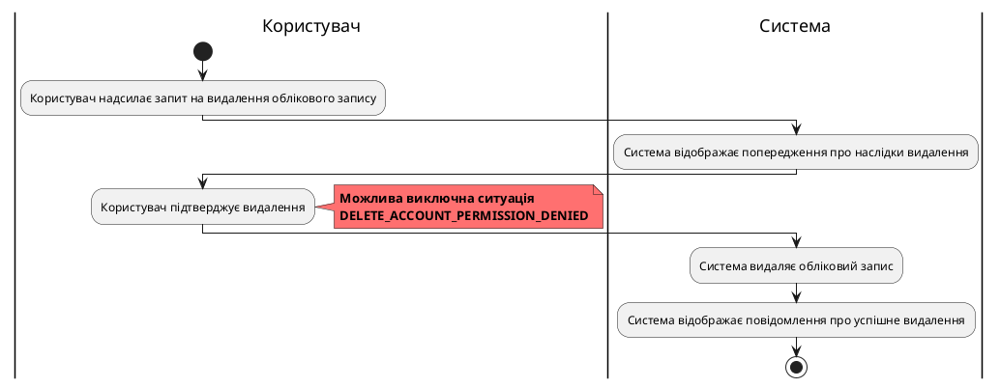
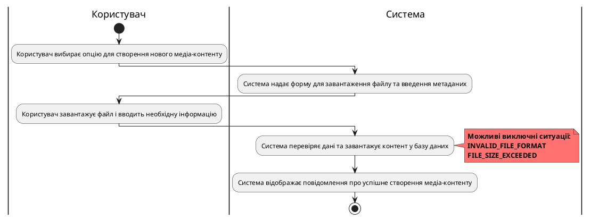

# Розроблення функціональних вимог до системи

## Модель прецедентів

### 1. Загальна схема

Рис. 1 Діаграма прецедентів

### 2. Схема використання для гостя

Рис. 2 Схема можливостей гостя

### 3. Схема використання для користувача

Рис. 3 Схема можливостей користувача

### 4. Схема використання для технічного експерта

Рис. 4 Схема можливостей технічного експерта

### 5. Сценарії використання для незареєстрованого користувача (гостя)
// (USER_REG, USER_LOGIN)
### 6. Сценарії використання для користувача
| **ID:**                   | USER_ACCOUNT_DELETE                         |
|---------------------------|------------------------------------------------------|
| **НАЗВА:**                | Видалення облікового запису користувача |
| **УЧАСНИКИ:**             | Користувач, Система                                 |
| **ПЕРЕДУМОВИ:**           | Користувач має бути авторизований у системі         |
| **РЕЗУЛЬТАТ:**            | Обліковий запис користувача видалено                |
| **ВИКЛЮЧНІ СИТУАЦІЇ:**    | Користувач не має прав на видалення облікового запису (DELETE_ACCOUNT_PERMISSION_DENIED) |
| **ОСНОВНИЙ СЦЕНАРІЙ:**    | Користувач надсилає запит на видалення облікового запису |
|                           | Система відображає попередження про наслідки видалення |
|                           | Користувач підтверджує видалення                 |
|                           | Система видаляє обліковий запис                  |
|                           | Система відображає повідомлення про успішне видалення |

| ID                        | USER_MEDIA_CREATE                            |
|---------------------------|------------------------------------------------------|
| **НАЗВА:**                 | Користувач створює новий медіа-контент               |
| **УЧАСНИКИ:**              | Користувач, Система                                 |
| **ПЕРЕДУМОВИ:**            | Користувач має бути авторизований у системі         |
| **РЕЗУЛЬТАТ:**             | Новий медіа-контент успішно створено                |
| **ВИКЛЮЧНІ СИТУАЦІЇ:**      | Недопустимий формат файлу (INVALID_FILE_FORMAT) |
|                           | Перевищено максимальний розмір файлу (FILE_SIZE_EXCEEDED) |
| **ОСНОВНИЙ СЦЕНАРІЙ:**     | Користувач вибирає опцію для створення нового медіа-контенту |
|                           | Система надає форму для завантаження файлу та введення метаданих |
|                           | Користувач завантажує файл і вводить необхідну інформацію |
|                           | Система перевіряє дані та завантажує контент у базу даних |
|                           | Система відображає повідомлення про успішне створення медіа-контенту |

### 7. Сценарії використання для технічного експерта
// (USER_ACCOUNT_BAN)
