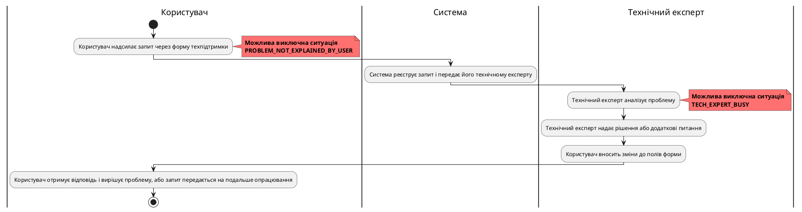
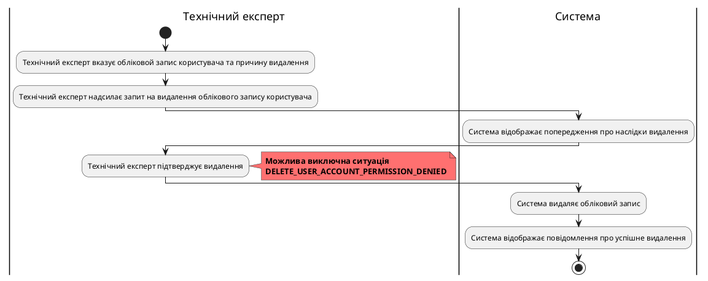

# Розроблення функціональних вимог до системи

## Модель прецедентів

### 1. Загальна схема

Рис. 1 Діаграма прецедентів

### 2. Схема використання для гостя

Рис. 2 Схема можливостей гостя

### 3. Схема використання для користувача

Рис. 3 Схема можливостей користувача

### 4. Схема використання для технічного експерта

Рис. 4 Схема можливостей технічного експерта

### 5. Сценарії використання для незареєстрованого користувача (гостя)
// (USER_REG, USER_LOGIN)
### 6. Сценарії використання для користувача

| ID                        | USER_SUPPORT                                |
|---------------------------|-----------------------------------------------------|
| **НАЗВА:**                 | Користувач звертається до технічної підтримки    |
| **УЧАСНИКИ:**              | Користувач, Система, Технічний експерт              |
| **ПЕРЕДУМОВИ:**            | Користувач має бути авторизований у системі         |
| **РЕЗУЛЬТАТ:**             | Проблему вирішено або запит зареєстровано для подальшого опрацювання |
| **ВИКЛЮЧНІ СИТУАЦІЇ:**      | Користувач не може пояснити проблему (PROBLEM_NOT_EXPLAINED_BY_USER) |
|                           | Технічний експерт недоступний (TECH_EXPERT_BUSY) |
| **ОСНОВНИЙ СЦЕНАРІЙ:**     | Користувач надсилає запит через форму техпідтримки |
|                           | Система реєструє запит і передає його технічному експерту |
|                           | Технічний експерт аналізує проблему              |
|                           | Технічний експерт надає рішення або додаткові питання |
|                           | Користувач отримує відповідь і вирішує проблему, або запит передається на подальше опрацювання |

// (USER_LOGOUT, USER_SEARCH_REQUEST, USER_ACCOUNT_DELETE, USER_MEDIA_CREATE, USER_MEDIA_DELETE, USER_MEDIA_EDIT, USER_SUPPORT)
### 7. Сценарії використання для технічного експерта

| **ID:**                   | USER_ACCOUNT_BAN                         |
|---------------------------|------------------------------------------------------|
| **НАЗВА:**                | Видалення облікового запису користувача технічним експертом |
| **УЧАСНИКИ:**             | Технічний експерт, Система                                 |
| **ПЕРЕДУМОВИ:**           | Користувач має активний обліковий запис     |
| **РЕЗУЛЬТАТ:**            | Обліковий запис користувача видалено                |
| **ВИКЛЮЧНІ СИТУАЦІЇ:**    | Технічний експерт не має прав на видалення облікового запису користувача (DELETE_USER_ACCOUNT_PERMISSION_DENIED) |
| **ОСНОВНИЙ СЦЕНАРІЙ:**    | Технічний експерт вказує обліковой запис користувача та причину видалення |
|                           | Технічний експерт надсилає запит на видалення облікового запису користувача |
|                           | Система відображає попередження про наслідки видалення |
|                           | Технічний експерт підтверджує видалення     |
|                           | Система видаляє обліковий запис                  |
|                           | Система відображає повідомлення про успішне видалення |

