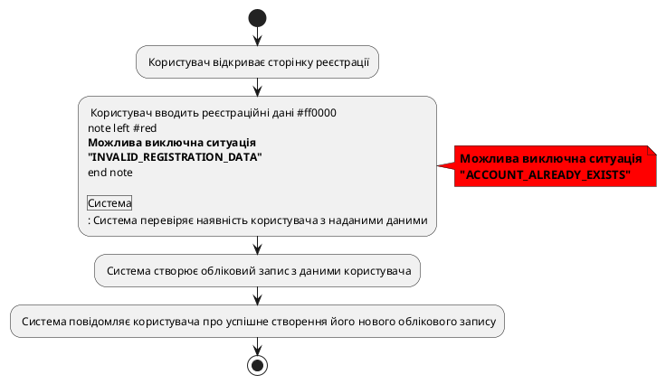
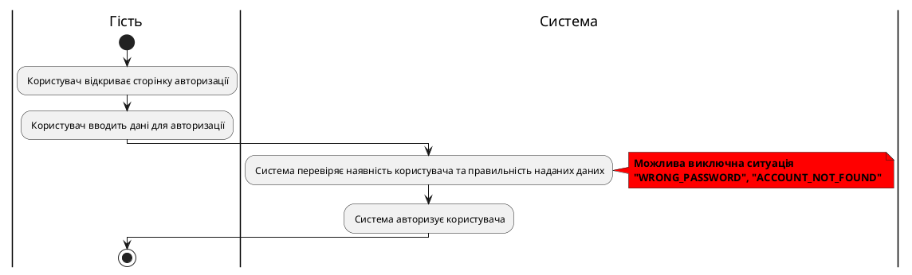

# Розроблення функціональних вимог до системи

## Модель прецедентів

### 1. Загальна схема

Рис. 1 Діаграма прецедентів

### 2. Схема використання для гостя

Рис. 2 Схема можливостей гостя

### 3. Схема використання для користувача

Рис. 3 Схема можливостей користувача

### 4. Схема використання для технічного експерта

Рис. 4 Схема можливостей технічного експерта

### 5. Сценарії використання для незареєстрованого користувача (гостя)
### Реєстрація
| **ID:**                   | USER_REG |
|---------------------------|----------------|
| **НАЗВА:**                | Реєстрація облікового запису користувача в системі |
| **УЧАСНИКИ:**             | Користувач, Система |
| **ПЕРЕДУМОВИ:**           | Користувач не має облікового запису в системі |
| **РЕЗУЛЬТАТ:**            | Створення нового облікового запису користувача |
| **ВИКЛЮЧНІ СИТУАЦІЇ:**    | Користувач вже зареєстрований (USER_ALREADY_REGISTERED) |
|                           | Під час реєстрації введені некоректні дані (INVALID_REGISTRATION_DATA) |
|                           | Обліковий запис з введеними даними вже існує (ACCOUNT_ALREADY_EXISTS) |
| **ОСНОВНИЙ СЦЕНАРІЙ:**    | Користувач відкриває сторінку реєстрації |
|                           | Користувач вводить реєстраційні дані |
|                           | Система перевіряє наявність користувача з наданими даними |
|                           | Система створює обліковий запис з даними користувача |
|                           | Система повідомляє користувача про успішне створення його нового облікового запису |

    

**Рис. 5.1** Сценарій реєстрації користувача

### Вхід

| **ID:**                   | USER_LOGIN |
|---------------------------|----------------|
| **НАЗВА:**                | Вхід користувача до системи |
| **УЧАСНИКИ:**             | Користувач, Система |
| **ПЕРЕДУМОВИ:**           | Користувач зареєстрований у системі |
| **РЕЗУЛЬТАТ:**            | Вхід користувача до системи |
| **ВИКЛЮЧНІ СИТУАЦІЇ:**    | Обліковий запис з введеними даними не існує (ACCOUNT_NOT_FOUND) |
|                           | Введений неправильний пароль (WRONG_PASSWORD) |
| **ОСНОВНИЙ СЦЕНАРІЙ:**    | Користувач відкриває сторінку авторизації |
|                           | Користувач вводить дані для авторизації |
|                           | Система перевіряє наявність користувача та правильність наданих даних |
|                           | Система авторизує користувача |

    

**Рис. 5.2** Сценарій входу користувача

### 6. Сценарії використання для користувача

| **ID:**                   | USER_LOGOUT |
|---------------------------|----------------|
| **НАЗВА:**                | Вихід користувача з системи |
| **УЧАСНИКИ:**             | Користувач, Система |
| **ПЕРЕДУМОВИ:**           | Користувач авторизований у системі |
| **РЕЗУЛЬТАТ:**            | Вихід з системи |
| **ВИКЛЮЧНІ СИТУАЦІЇ:**    | Користувач не авторизований у системі (USER_NOT_AUTHORIZED) |
| **ОСНОВНИЙ СЦЕНАРІЙ:**    | Користувач натискає кнопку виходу (Logout) із системи |
|                           | Система завершує поточну сесію з користувачем |
|                           | Система перенаправляє користувача на головну сторінку додатку |

Рис. 7 Сценарій USER_LOGOUT

   
 

| **ID:**                   | USER_SEARCH_REQUEST |
|---------------------------|------------------------------------|
| **НАЗВА:**                | Пошук контенту            |
| **УЧАСНИКИ:**             | Користувач, Система                                |
| **ПЕРЕДУМОВИ:**           | Користувач має бути авторизований у системі        |
| **РЕЗУЛЬТАТ:**            | Знайдені дані відображаються на екрані             |
| **ВИКЛЮЧНІ СИТУАЦІЇ:**    | У запиті містяться недопустимі символи (INVALID_QUERY_CHARACTERS) |
|                           | Забагато запитів за короткий період (TOO_MANY_REQUESTS) |
| **ОСНОВНИЙ СЦЕНАРІЙ:**    | Користувач заповнює форму пошуку              |
|                           | Користувач надсилає запит на пошук |
|                           | Система виконує пошук у базі даних              |
|                           | Система виводить результат пошуку на екран       |

Рис. 8 Сценарій USER_SEARCH_REQUEST

  

// (USER_ACCOUNT_DELETE, USER_MEDIA_CREATE, USER_MEDIA_DELETE, USER_MEDIA_EDIT, USER_SUPPORT)
### 7. Сценарії використання для технічного експерта
// (USER_ACCOUNT_BAN)
